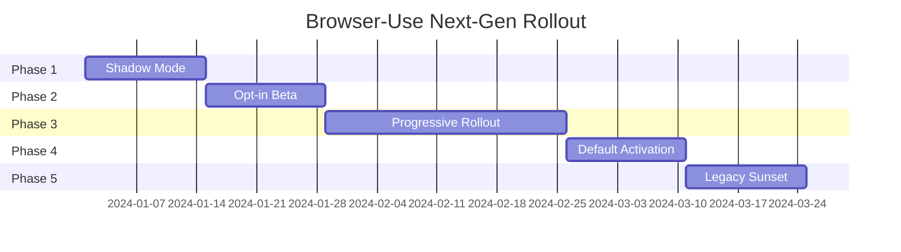

# Next-Generation Browser-Use Rollout Strategy

## Overview

This document outlines the gradual rollout strategy for transitioning from the current browser-use architecture to the new intent-driven system. The rollout is designed to minimize disruption while maximizing adoption success.

## Rollout Phases

### Phase 1: Shadow Mode (Weeks 1-2)
**Goal**: Validate new architecture without impacting users

#### Implementation
```python
# Enable shadow mode in configuration
BROWSER_USE_CONFIG = {
    "next_gen_enabled": True,
    "shadow_mode": True,
    "telemetry_enabled": True,
    "comparison_mode": True
}
```

#### Activities
1. **Dual Execution**
   - Both old and new systems run in parallel
   - Results are compared but only old system results are returned
   - Performance metrics collected for both

2. **Telemetry Collection**
   - Token usage comparison
   - Execution time comparison
   - Success rate tracking
   - Error pattern analysis

3. **Monitoring Dashboard**
   ```python
   # Example telemetry data
   {
       "execution_id": "123",
       "old_system": {
           "tokens": 12000,
           "time_ms": 5000,
           "success": true
       },
       "new_system": {
           "tokens": 1200,
           "time_ms": 500,
           "success": true
       }
   }
   ```

### Phase 2: Opt-in Beta (Weeks 3-4)
**Goal**: Early adopter feedback and real-world testing

#### Implementation
```python
# Users can opt-in to new system
agent = create_agent(
    llm=your_llm,
    use_next_gen=True,  # Opt-in flag
    fallback_enabled=True  # Automatic fallback on errors
)
```

#### Features
1. **Feature Flags**
   ```python
   FEATURE_FLAGS = {
       "intent_analysis": True,
       "vision_perception": True,
       "parallel_execution": True,
       "smart_caching": True,
       "predictive_prefetch": False  # Disabled initially
   }
   ```

2. **Automatic Fallback**
   ```python
   try:
       result = await next_gen_agent.execute_task(task)
   except NextGenException:
       logger.warning("Falling back to legacy system")
       result = await legacy_agent.run(task)
   ```

3. **Beta Documentation**
   - Migration guide for early adopters
   - Known limitations
   - Feedback channels

### Phase 3: Progressive Rollout (Weeks 5-8)
**Goal**: Gradual migration of all users

#### Implementation
```python
# Percentage-based rollout
def should_use_next_gen(user_id: str) -> bool:
    # Start at 10%, increase weekly
    rollout_percentage = get_current_rollout_percentage()
    user_hash = hash(user_id) % 100
    return user_hash < rollout_percentage
```

#### Schedule
- Week 5: 10% of users
- Week 6: 25% of users
- Week 7: 50% of users
- Week 8: 75% of users

#### Monitoring
```python
# A/B test metrics
{
    "cohort": "next_gen",
    "metrics": {
        "avg_tokens_per_action": 1500,
        "avg_time_per_action": 0.5,
        "success_rate": 0.92,
        "user_satisfaction": 4.5
    }
}
```

### Phase 4: Default Activation (Weeks 9-10)
**Goal**: Make new system the default

#### Implementation
```python
# New system is default, opt-out available
agent = create_agent(
    llm=your_llm,
    use_legacy=False  # Default is now next-gen
)

# Legacy mode still available
legacy_agent = create_agent(
    llm=your_llm,
    use_legacy=True,
    deprecation_warning=True
)
```

#### Communication
1. **Deprecation Notices**
   ```python
   warnings.warn(
       "Legacy browser-use API will be deprecated in version 3.0. "
       "Please migrate to the new intent-driven API. "
       "See: https://docs.browser-use.com/migration",
       DeprecationWarning
   )
   ```

2. **Migration Assistance**
   - Automated migration tool runs
   - Support channels active
   - Office hours for complex migrations

### Phase 5: Legacy Sunset (Weeks 11-12)
**Goal**: Complete transition to new architecture

#### Implementation
```python
# Legacy code moved to separate package
# pip install browser-use-legacy

from browser_use_legacy import Agent as LegacyAgent
```

#### Final Steps
1. **Documentation Update**
   - All docs reflect new architecture
   - Legacy docs archived
   - Tutorial videos updated

2. **Community Transition**
   - Example code updated
   - Community contributions migrated
   - Stack Overflow answers updated

## Risk Mitigation

### 1. Performance Regression
**Risk**: New system performs worse in specific scenarios

**Mitigation**:
```python
# Performance guard rails
class PerformanceGuard:
    def __init__(self, thresholds):
        self.thresholds = thresholds
    
    async def check_performance(self, result):
        if result.tokens_used > self.thresholds.max_tokens:
            await self.alert_and_rollback()
        if result.execution_time > self.thresholds.max_time:
            await self.alert_and_rollback()
```

### 2. Breaking Changes
**Risk**: Existing code breaks despite compatibility layer

**Mitigation**:
```python
# Comprehensive compatibility testing
@pytest.mark.compatibility
async def test_legacy_code_patterns():
    # Test all known usage patterns
    patterns = load_usage_patterns_from_telemetry()
    for pattern in patterns:
        assert await test_pattern_compatibility(pattern)
```

### 3. User Confusion
**Risk**: Users confused by new concepts

**Mitigation**:
- Interactive migration wizard
- Video tutorials
- Live coding sessions
- Community ambassadors

## Success Metrics

### Technical Metrics
| Metric | Target | Measurement |
|--------|--------|-------------|
| Token Reduction | >80% | Telemetry |
| Speed Improvement | >5x | Benchmarks |
| Success Rate | >90% | Production |
| Memory Usage | <50% | Monitoring |

### User Metrics
| Metric | Target | Measurement |
|--------|--------|-------------|
| Migration Success | >95% | Surveys |
| User Satisfaction | >4/5 | NPS |
| Support Tickets | <2x baseline | Support System |
| Adoption Rate | >80% by week 10 | Analytics |

## Communication Plan

### 1. Pre-Launch (2 weeks before)
- Blog post announcement
- Email to all users
- Social media campaign
- Documentation preview

### 2. During Rollout
- Weekly progress updates
- Success stories
- Tips and tricks
- Issue resolutions

### 3. Post-Launch
- Case studies
- Performance reports
- Community feedback
- Future roadmap

## Rollback Procedures

### Automatic Rollback Triggers
```python
ROLLBACK_TRIGGERS = {
    "error_rate": 0.05,  # >5% errors
    "performance_degradation": 0.2,  # >20% slower
    "memory_spike": 2.0,  # >2x memory
    "user_complaints": 10  # Per hour
}
```

### Manual Rollback Process
```bash
# Emergency rollback command
browser-use-admin rollback --version=stable --reason="Performance issues"

# Gradual rollback
browser-use-admin rollback --percentage=50 --monitor=true
```

## Support Structure

### 1. Documentation
- Migration guide
- API reference
- Video tutorials
- FAQ section

### 2. Direct Support
- Dedicated migration team
- Office hours (timezone coverage)
- Priority support queue
- Community forum

### 3. Tools
```bash
# Migration assistant
browser-use-migrate check
browser-use-migrate convert --file=my_script.py
browser-use-migrate validate

# Performance analyzer
browser-use-analyze compare --old=trace1.json --new=trace2.json
```

## Timeline Summary



## Conclusion

This gradual rollout strategy ensures a smooth transition to the next-generation browser-use architecture while minimizing risk and maximizing user success. The key principles are:

1. **Gradual**: No sudden changes
2. **Monitored**: Continuous tracking
3. **Reversible**: Can rollback anytime
4. **Supported**: Help available throughout
5. **Transparent**: Clear communication

By following this strategy, we can deliver the 10x performance improvements and enhanced capabilities of the new architecture while maintaining the trust and productivity of our user base.